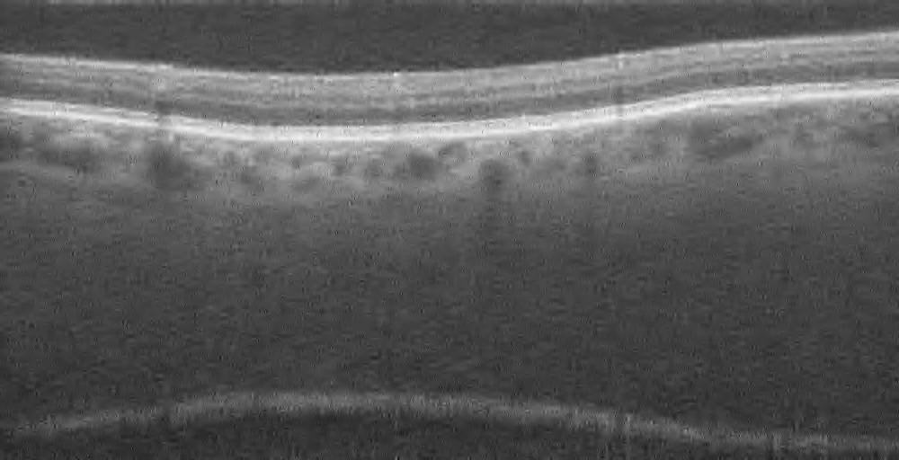
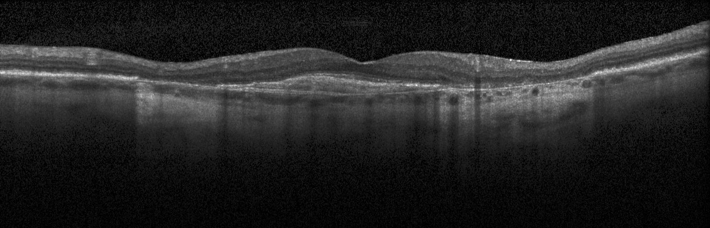
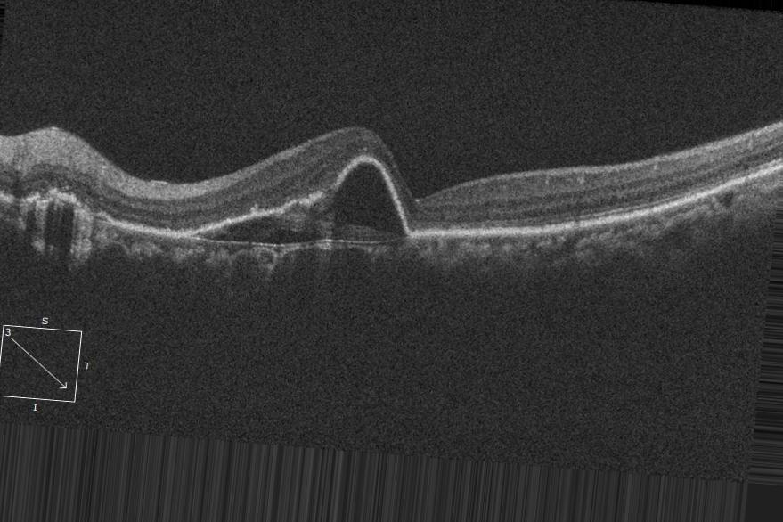
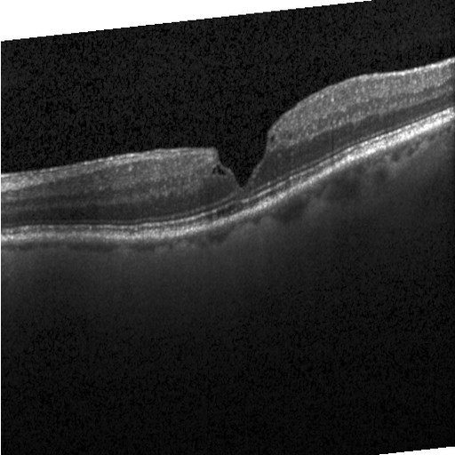
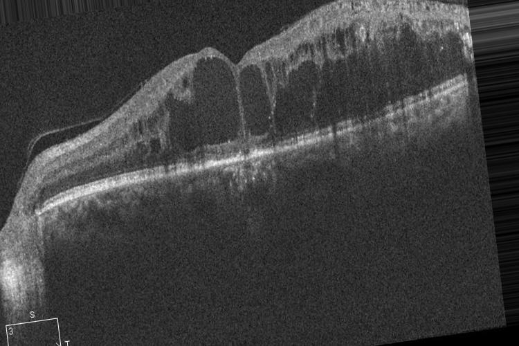
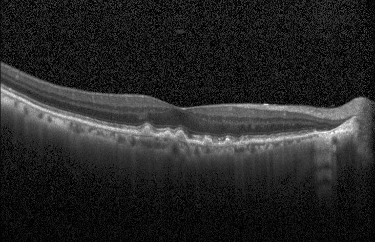
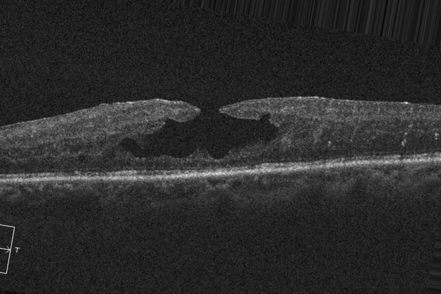
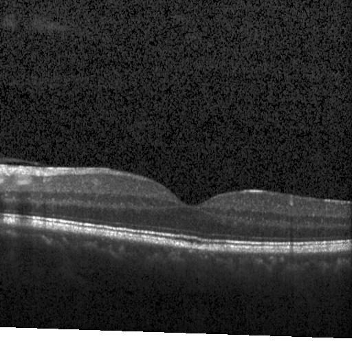

## Dataset (Retinal OCT C8)

<table>
<tr>
<td align="center">
<br>
<b>AMD</b>
</td>

<td align="center">
<br>
<b>CNV</b>
</td>

<td align="center">
<br>
<b>CSR</b>
</td>

<td align="center">
<br>
<b>DME</b>
</td>
</tr>

<tr>
<td align="center">
<br>
<b>DR</b>
</td>

<td align="center">
<br>
<b>Drusen</b>
</td>

<td align="center">
<br>
<b>MH</b>
</td>

<td align="center">
<br>
<b>Normal</b>
</td>
</tr>
</table>

- **Total images:** ~21,200  
- **Classes:** 8  
- **Image type:** Retinal OCT images (`.jpg`)  
- **Official source:** Kaggle (recommended)

### Download Links

- **Kaggle (official):**  
https://www.kaggle.com/datasets/obulisainaren/retinal-oct-c8

> Important: Do **not** commit the dataset images to this repository.  
> Download the dataset locally and place it under `Datasets/`.

---

### Kaggle Download (CLI)

1. Install Kaggle API credentials  
https://github.com/Kaggle/kaggle-api#api-credentials

2. Download

```bash
kaggle datasets download -d obulisainaren/retinal-oct-c8
   ```

3. Unzip and arrange images into the structure below.

### Expected Dataset Structure

Create the following structure inside the project root:


```text
Datasets/
  train/
    AMD/
    CNV/
    CSR/
    DME/
    DR/
    DRUSEN/
    MH/
    NORMAL/
  val/
    AMD/
    CNV/
    CSR/
    DME/
    DR/
    DRUSEN/
    MH/
    NORMAL/
  test/
    AMD/
    CNV/
    CSR/
    DME/
    DR/
    DRUSEN/
    MH/
    NORMAL/
```
This layout is compatible with **PyTorch `torchvision.datasets.ImageFolder`**.

### Class Labels

| Label | Description |
|------:|------------|
| `AMD` | Age-related Macular Degeneration |
| `CNV` | Choroidal Neovascularization |
| `CSR` | Central Serous Retinopathy |
| `DME` | Diabetic Macular Edema |
| `DR` | Diabetic Retinopathy |
| `Drusen` | Retinal Drusen Deposits |
| `MH` | Macular Hole |
| `Normal` | Healthy Retina |

## Usage Example (PyTorch)

```python
from torchvision import transforms
from torchvision.datasets import ImageFolder
from torch.utils.data import DataLoader

transform = transforms.Compose([
    transforms.Resize((224, 224)),
    transforms.ToTensor(),
    transforms.Normalize(mean=[0.485, 0.456, 0.406],
                         std=[0.229, 0.224, 0.225])
])

train_dataset = ImageFolder("Datasets/train", transform=transform)

train_loader = DataLoader(
    train_dataset,
    batch_size=32,
    shuffle=True,
    num_workers=4
)
```

## Notes

- The dataset contains **retinal OCT scans used for diagnosing multiple retinal diseases**.
- Some disease classes may share **similar structural patterns in OCT images**, which can make classification challenging.
- Ensure your dataset splits (`train/`, `val/`, `test/`) are created consistently and do not overlap.

## Acknowledgements / License

- Dataset author: **Obuli Sai Naren**
- Kaggle hosting + documentation:  
  https://www.kaggle.com/datasets/obulisainaren/retinal-oct-c8

This repository is intended for **academic and research purposes**. Please refer to the official dataset page for **licensing and citation requirements**.

- **Classes:** 8
- **Image type:** Retinal OCT images (`.jpg`)
- **Official source:** Kaggle (recommended)
